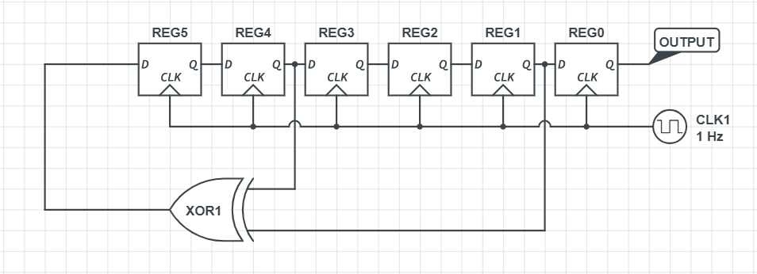

# Shifty Boi

Hardware 75pt

## Challenge

Seed: 6'b111111 Hint: {0xbc, 0x1c, 0x56, 0x06, 0xab, 0xb5, 0x61, 0xa0, 0xe2, 0x8b, 0x55, 0xed, 0x74, 0xdd, 0x2f, 0x60}

made by Ed Krawczyk.



## Solution

This looks like a `Linear Feedback Shift Register`.

I implemented the LFSR and then xor cipher with hint.

```py
hint = [0xbc, 0x1c, 0x56, 0x06, 0xab, 0xb5, 0x61, 0xa0, 0xe2, 0x8b, 0x55, 0xed, 0x74, 0xdd, 0x2f, 0x60]

class LFSR:
    def __init__(self, seed):
        assert len(seed) == 6
        self.reg = seed

    def clock(self):
        last = self.reg[:]
        self.reg[0] = last[1]
        self.reg[1] = last[2]
        self.reg[2] = last[3]
        self.reg[3] = last[4]
        self.reg[4] = last[5]
        self.reg[5] = last[4] ^ last[1]
        return last[0]

lfsr = LFSR([1, 1, 1, 1, 1, 1])
flag = ''
for h in hint[::-1]:
    x = [lfsr.clock() for i in range(8)][::-1]
    x = ''.join(map(str, x))
    x = int(x, 2)
    flag = chr(x ^ h) + flag

print(flag) # _i_am_soo_proud_
```

flag is `WPI{i_am_soo_proud}`
